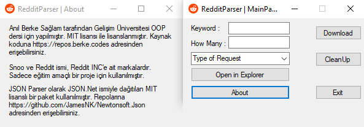
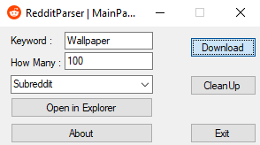

  

# RedditParser 🤖

> Wanna download some stuff from Reddit? Just use it.

  

   

  
  
  



  

## Installation

  

```

- Download latest release.

- Extract it to its own folder.

- Double click RedditParser.exe

```

  

## Usage example


```

- Fill blank spots.

- Click download.

- After files downloaded, you can click clean up and delete corrupted or removed files.

``` 
  

## Development setup

```

- Clone repo.

- Open it with Visual Studio.

- Install 3rd party packages.

- You are good to go. 🥳

```

## Meta

  

Anıl Berke Sağlam – [@g3vxyv]([https://twitter.com/g3vxyv](https://twitter.com/g3vxyv)) – anilberkesaglam@gmail.com

  

Distributed under the MIT license.

  

## Contributing

  

1. Fork it (<https://github.com/g3vxy/RedditParser/fork>)

2. Create your feature branch (`git checkout -b feature/fooBar`)

3. Commit your changes (`git commit -am 'Add some fooBar'`)

4. Push to the branch (`git push origin feature/fooBar`)

5. Create a new Pull Request